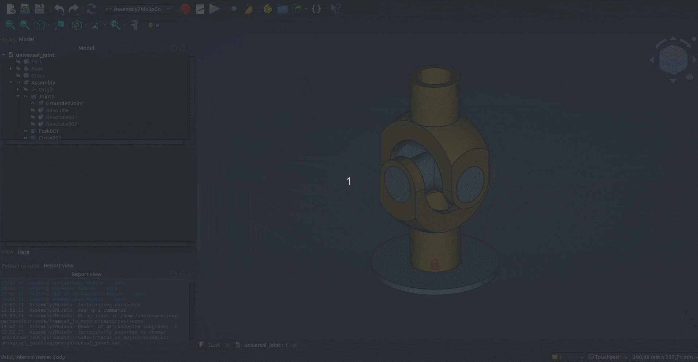
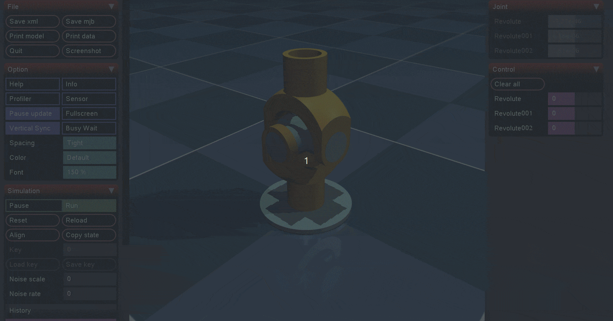
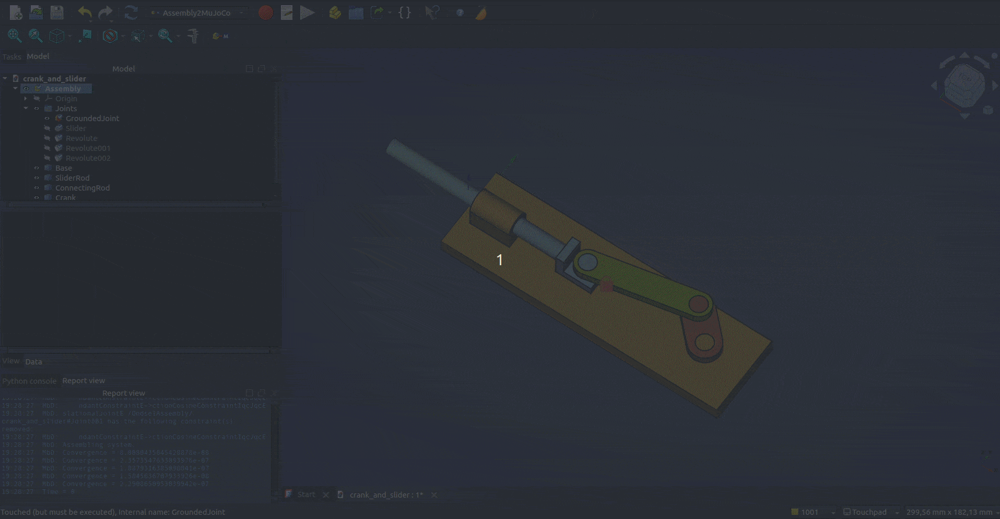
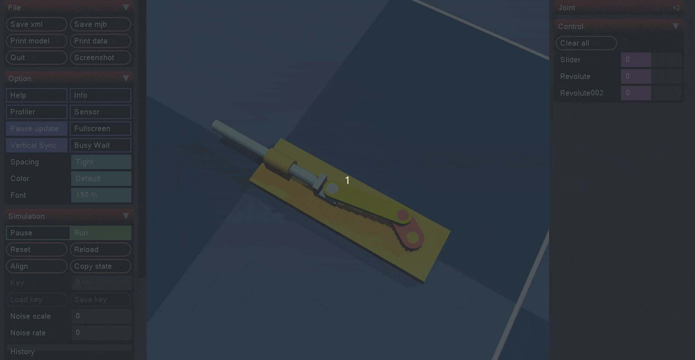

# Examples

These examples showcase how to use this macro to export assemblies to MuJoCo.

## Universal Joint

A universal joint is a joint or coupling connecting rigid rods whose axes
are inclined to each other and is commonly used in shafts that transmit rotary motion.

Part of this example is taken from the universal joint example found in
the [Assembly Workbench](https://wiki.freecad.org/Assembly_Workbench) page of the FreeCAD Wiki.

| FreeCAD | MuJoCo |
|---|---|
|  |  |

## Crank and Slider

A crank and slider mechanism is a mechanical system that converts rotary motion into linear motion or vice versa, commonly used in engines and pumps.

Part of this example is taken from the universal joint example found in
the [Assembly Workbench](https://wiki.freecad.org/Assembly_Workbench) page of the FreeCAD Wiki.

| FreeCAD | MuJoCo |
|---|---|
|  |  |
