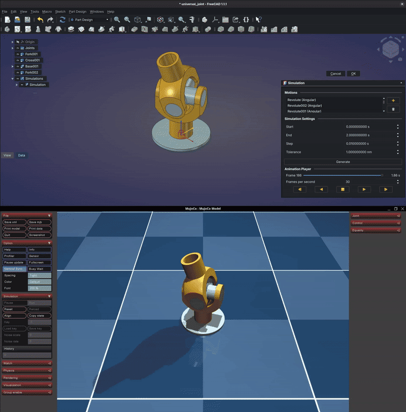
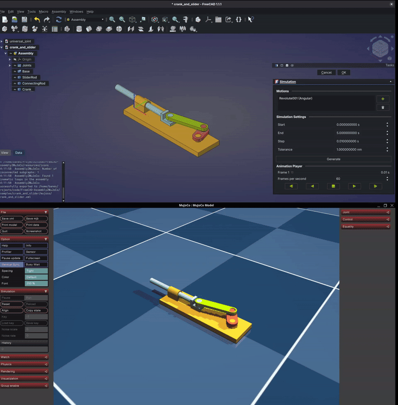
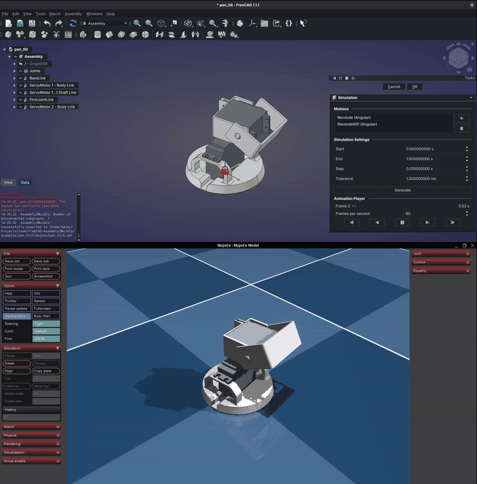

# Examples

These examples showcase how to use this macro to export assemblies to MuJoCo.

## Universal Joint

A universal joint is a joint or coupling connecting rigid rods whose axes
are inclined to each other and is commonly used in shafts that transmit rotary motion.

Part of this example is taken from the universal joint example found in
the [Assembly Workbench](https://wiki.freecad.org/Assembly_Workbench) page of the FreeCAD Wiki.

## Crank and Slider

A crank and slider mechanism is a mechanical system that converts rotary motion into linear motion or vice versa, commonly used in engines and pumps.

Part of this example is taken from the universal joint example found in
the [Assembly Workbench](https://wiki.freecad.org/Assembly_Workbench) page of the FreeCAD Wiki.

## Pan Tilt Mechanism

A pan tilt mechanism allows for the horizontal (pan) and vertical (tilt) movement of cameras or sensors, commonly used in robotics, surveillance, and photography.

This example was created for another project but was deemed useful enough to be shared here as an example.

## Vise

A vise is a mechanical apparatus used to secure an object to allow work to be performed on it.

Part of this example is taken from the vise example found in the
[Assembly Workbench](https://wiki.freecad.org/Assembly_Workbench) page of the FreeCAD Wiki.

## Shock Absorber

A shock absorber is a mechanical device that dampens vibrations or oscillations, commonly used in vehicle suspensions.

Part of this example is taken from the shock absorber example found in the
[Assembly Workbench](https://wiki.freecad.org/Assembly_Workbench) page of the FreeCAD Wiki.

